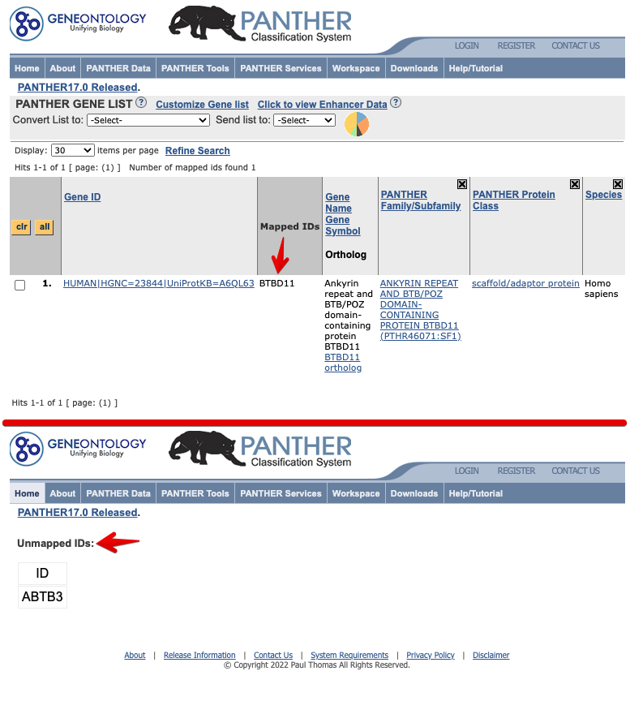

# (PART\*) Part I: Search Information {-}


# Search gene metadata {#search-gene-metadata-1}

```{r include=FALSE}
library(knitr)
opts_chunk$set(message = FALSE, warning = FALSE, eval = TRUE, echo = TRUE, cache = TRUE)
library(genekitr)
library(dplyr)
library(DT)
```

`genInfo()` function helps the user quickly search batch of gene metadata such as names, location, GC content, etc.

## Supported organisms {#geninfo-supported-species}

It supports 195 vertebrate species, 120 plant species, and two bacteria species. All data is up-to-date.

```{r geninfo-orgname}
# install.packages('DT')
library(genekitr)
DT::datatable(ensOrg_name, options = list(pageLength = 10))
```

A user could select an organism name from the `latin_short_name` column. 

The common name is also acceptable for popular research species (e.g., human, mouse, rat, fly, zebrafish, worm, chicken). Take human as an example, the official latin short name is "hsapiens", while" hg", "hsa", "hs", or "human" are also acceptable.

## Basic usage {#geninfo-basic-usage}

`genInfo` only has three arguments:

- `id`: gene id (symbol, Entrez or Ensembl) or protein id

- `org`: organism name, default is human

- `unique`: `TRUE` or `FALSE`. Commonly, one gene could have many other types of matched records. For example, the human `HBD` gene has three matched Entrez IDs: `r Entrez("3045")`, `r Entrez("85349")`, and `r Entrez("100187828")`. If `TRUE,` only return a one-to-one match result with smallest entrezid or maximal information (that is minimal NAs). See example [genekitr feature2](#geninfo-feature-2).

```{r geneinfo-basic-usage}
id <- c("TP53", "BRCA1", "TET2")
info <- genInfo(id)
colnames(info)
head(info, 3)
```


## Features {#geninfo-features}

### f1: keep input order {#geninfo-feature-1}

`genInfo` result will strictly keep up with the input order.

If a gene id is unrecognized (e.g., misspelled or does not belong to the organism), the return data will be NA.

```{r}
id <- c(
  "MCM10", "CDC20", "S100A9",
  "FAKEID", "TP53", "HBD", "NUDT10"
)
# for human id, no need to input the org argument
info <- genInfo(id, unique = TRUE)
identical(id, info$input_id)
head(info, 3)
```

### f2: keep unique or not {#geninfo-feature-2}

If `unique = TRUE`, only one record with maximal information is returned.

```{r }
id <- "HBD"
uniq_info <- genInfo(id, org = "hs", unique = TRUE)
uniq_info[, 1:4]

all_info <- genInfo(id, org = "hs", unique = FALSE)
all_info[, 1:4]
```


### f3: disambiguation feature {#geninfo-feature-3}

#### distinguish from gene symbol and alias

Many common gene names are gene alias, but many tools only accept gene symbols which cause gene information to be lost. For example, "BCC7" is the alias of "TP53" and "PD1" has three aliases: "PDCD1", "SNCA" and "SPATA2" while few enrichment analyses tools recognize "BCC7".

```{r}
id <- c("BCC7", "PD1")
genInfo(id)[1:4]
```

#### distinguish gene symbol with special characters

```{r}
id <- c("TNF-α", "κB-Ras2")
genInfo(id)[1:4]
```


### f4: count organism gene types {#geninfo-feature-4}

```{r}
uniq_symbol <- genInfo(org = "hs") %>%
  dplyr::filter(!is.na(gene_biotype)) %>%
  dplyr::distinct(symbol, .keep_all = T)

uniq_symbol %>%
  {
    table(.$gene_biotype)
  }
```


### f5: extract specific biotype genes {#geninfo-feature-5}

Get all human protein-coding genes:

```{r}
hg_pro_gene <- uniq_symbol %>%
  dplyr::filter(gene_biotype == "protein_coding") %>%
  dplyr::pull(symbol)

length(hg_pro_gene)
```

Compare with [HGNC data](http://ftp.ebi.ac.uk/pub/databases/genenames/hgnc/tsv/locus_types/gene_with_protein_product.txt):


```{r eval=FALSE}
hgnc_data <- vroom::vroom("http://ftp.ebi.ac.uk/pub/databases/genenames/hgnc/tsv/locus_types/gene_with_protein_product.txt")
hgnc_symbol <- hgnc_data$symbol
plotVenn(list(
  genekitr_symbol = hg_pro_gene,
  hgnc_symbol = hgnc_symbol
))
```


```{r echo=FALSE}
hgnc_data <- rio::import("data/gene_with_protein_product.txt")
hgnc_symbol <- hgnc_data$symbol
plotVenn(list(
  genekitr_symbol = hg_pro_gene,
  hgnc_symbol = hgnc_symbol
))
```

Check some missing gene names in our result:
```{r}
check_genes <- head(hgnc_symbol[!hgnc_symbol %in% hg_pro_gene], 3)
hgnc_data %>%
  dplyr::filter(symbol %in% check_genes) %>%
  dplyr::select(
    symbol, date_approved_reserved, date_symbol_changed,
    entrez_id
  )
```

Let's look at the first one "ABTB3":

It seems that the gene "ABTB3" is recently modified, while it is also known as "BTBD11" which matched with our Ensembl data: `r Ensembl("ENSG00000151136")`

```{r}
genInfo("121551")[1:3]
```

So the reason for the mismatch is out-of-sync of the large database Ensembl and NCBI. However, the mismatch number is small so the effect is not serious.

> Here is my personal view:

NCBI updates backend data everydata while Ensembl follows a quarterly update cycle.

As long as our genes are not so outdated, it can also finish gene annotation such as enrichment analysis. It is not recommended to keep gene names updated like NCBI because other large databases could not follow a very high updating frequency. 

For example, the gene "BTBD11" (BTB/POZ domain-containing protein 11) could be recognized in [GeneOntology](http://geneontology.org/) while the latest one "ABTB3" is not synced yet. If using NCBI name, user may not get related enrichment information about this gene.

(ref:BTBD11GOScap) BTBD11 vs ABTB3 in GeneOntology

(ref:BTBD11GOCap) **BTBD11 vs ABTB3 in GeneOntology** 

```{r BTBD11GO, out.width="100%", echo=FALSE, fig.cap="(ref:BTBD11GOCap)", fig.scap="(ref:BTBD11GOScap)"}

```

### f6: extract all metadata {#geninfo-feature-6}

If user only wants to get all information, just give `org` argument alone.

```{r}
all_human_data <- genInfo(org = "human")
dim(all_human_data)
```

### f7: extract human cell markers {#geneinfo-feature-7}

[CellMarker database](http://xteam.xbio.top/CellMarker/index.jsp) has manually curated over 100,000 published papers, 4,124 entries including the cell marker information, tissue type, cell type, cancer information and source.

Here, `geneInfo` integrated human cell markers into `cell_marker` column. 

The naming rules is: `tissue_type | cancer_type: Tumor(T) or Normal(N) | cell_type`, if one gene matches many cell types, they are seperated with `; `.

```{r}
hg_marker_all <- genInfo(org = "human") %>%
  dplyr::select(symbol, cell_marker) %>%
  dplyr::filter(!is.na(cell_marker)) %>%
  tidyr::separate_rows(cell_marker, sep = "; ") %>%
  dplyr::mutate(cell_marker = gsub("^.*\\|", "", cell_marker)) %>%
  dplyr::distinct()
head(hg_marker_all)

# select stromal cell markers
hg_marker_all %>%
  dplyr::filter(cell_marker == "Stromal cell") %>%
  dplyr::pull(symbol) %>%
  sort()
```


