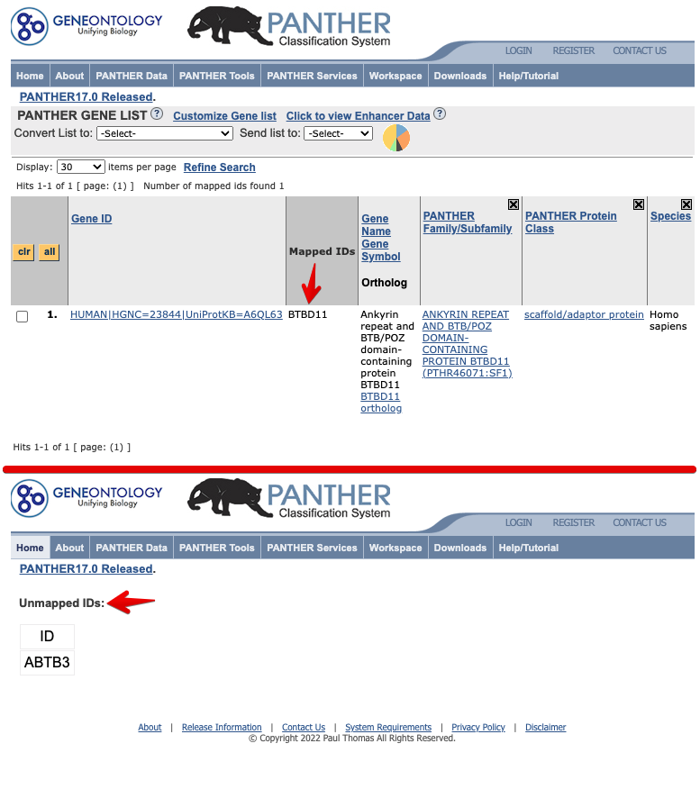

# (PART\*) Part I: Search Information {-}


# Search gene metadata {#search-gene-metadata-1}

```{r include=FALSE}
library(knitr)
opts_chunk$set(message = FALSE, warning = FALSE, eval = TRUE, echo = TRUE, cache = TRUE)
library(genekitr)
library(dplyr)
library(DT)
```

The `genInfo()` function helps users quickly search a batch of gene metadata, such as gene names, genomic location, GC content, and more.

## Supported organisms {#geninfo-supported-species}

It supports 195 vertebrate species, 120 plant species, and two bacterial species. All data is kept up to date.

```{r geninfo-orgname}
# install.packages('DT')
library(genekitr)
DT::datatable(ensOrg_name, options = list(pageLength = 10))
```

Users can select an organism name from the `latin_short_name` column.

Common names are also acceptable for popular research species (e.g., human, mouse, rat, fly, zebrafish, worm, chicken). Taking human as an example, the official Latin short name is "hsapiens", while "hg", "hsa", "hs", and "human" are also acceptable.

## Basic usage {#geninfo-basic-usage}

`genInfo` only has three arguments:

- `id`: gene ID (symbol, Entrez, or Ensembl) or protein ID

- `org`: organism name, default is human

- `unique`: `TRUE` or `FALSE`. Commonly, one gene may have multiple matched records of the same ID type. For example, the human `HBD` gene has three matched Entrez IDs: `r Entrez("3045")`, `r Entrez("85349")`, and `r Entrez("100187828")`. If set to `TRUE`, only a one-to-one match with the smallest Entrez ID or the most complete information (i.e., the fewest NAs) will be returned. See [genekitr feature2](#geninfo-feature-2) for an example.

```{r geneinfo-basic-usage}
id <- c("TP53", "BRCA1", "TET2")
info <- genInfo(id)
colnames(info)
head(info, 3)
```


## Features {#geninfo-features}

### f1: keep input order {#geninfo-feature-1}

The `genInfo` output will strictly follow the input order.

If a gene ID is unrecognized (e.g., misspelled or not found in the specified organism), the corresponding row will be filled with NA.

```{r}
id <- c(
  "MCM10", "CDC20", "S100A9",
  "FAKEID", "TP53", "HBD", "NUDT10"
)
# for human id, no need to input the org argument
info <- genInfo(id, unique = TRUE)
identical(id, info$input_id)
head(info, 3)
```

### f2: keep unique or not {#geninfo-feature-2}

If `unique = TRUE`, only one record with the most complete information is returned.

```{r }
id <- "HBD"
uniq_info <- genInfo(id, org = "hs", unique = TRUE)
uniq_info[, 1:4]

all_info <- genInfo(id, org = "hs", unique = FALSE)
all_info[, 1:4]
```


### f3: disambiguation feature {#geninfo-feature-3}

#### Distinguishing gene symbols from aliases

Many commonly used gene names are actually gene aliases, but most tools only accept official gene symbols, which can cause important information to be lost. For example, "BCC7" is an alias of "TP53", and "PD1" has three aliases: "PDCD1", "SNCA", and "SPATA2" — yet few enrichment analysis tools are able to recognize aliases such as "BCC7".

```{r}
id <- c("BCC7", "PD1")
genInfo(id)[1:4]
```

#### Distinguishing gene symbols with special characters

```{r}
id <- c("TNF-α", "κB-Ras2")
genInfo(id)[1:4]
```


### f4: count organism gene types {#geninfo-feature-4}

```{r}
org <- "hs"
uniq_symbol <- genInfo(org = org) %>%
  dplyr::filter(!is.na(gene_biotype)) %>%
  dplyr::distinct(symbol, .keep_all = T)

uniq_symbol %>%
  {
    table(.$gene_biotype)
  }
```

### f5: extract all metadata {#geninfo-feature-5}

If you only want to retrieve all available information, simply provide the `org` argument alone.

```{r}
all_human_data <- genInfo(org = "human")
dim(all_human_data)
```


### f6: extract specific biotype genes {#geninfo-feature-6}

##### Get all human protein-coding genes:

```{r}
hg_pro_gene <- uniq_symbol %>%
  dplyr::filter(gene_biotype == "protein_coding") %>%
  dplyr::pull(symbol)

length(hg_pro_gene)
```

##### Compare with [HGNC data](http://ftp.ebi.ac.uk/pub/databases/genenames/hgnc/tsv/locus_types/gene_with_protein_product.txt):


```{r eval=FALSE}
hgnc_data <- vroom::vroom("http://ftp.ebi.ac.uk/pub/databases/genenames/hgnc/tsv/locus_types/gene_with_protein_product.txt")
hgnc_symbol <- hgnc_data$symbol
plotVenn(list(
  genekitr_symbol = hg_pro_gene,
  hgnc_symbol = hgnc_symbol
))
```


```{r echo=FALSE}
hgnc_data <- rio::import("data/gene_with_protein_product.txt")
hgnc_symbol <- hgnc_data$symbol
plotVenn(list(
  genekitr_symbol = hg_pro_gene,
  hgnc_symbol = hgnc_symbol
))
```

Let's check some gene names missing from our result:
```{r}
check_genes <- head(hgnc_symbol[!hgnc_symbol %in% hg_pro_gene], 3)
hgnc_data %>%
  dplyr::filter(symbol %in% check_genes) %>%
  dplyr::select(
    symbol, date_approved_reserved, date_symbol_changed,
    entrez_id
  )
```

Let's take a look at the first one, "ABTB3":

It seems that the gene "ABTB3" was recently renamed; it is also known as "BTBD11", which matches our Ensembl data: `r Ensembl("ENSG00000151136")`

```{r}
genInfo("121551")[1:3]
```

So the reason for this mismatch is that the two large databases, Ensembl and NCBI, are not perfectly synced with each other. However, since the number of such mismatches is small, the overall effect is minor.

> Here is my personal take on this:

NCBI updates its backend data daily, while Ensembl follows a quarterly update cycle.

As long as our gene data isn't too outdated, it can still support downstream annotation tasks such as enrichment analysis. I wouldn't recommend keeping gene names as up to date as NCBI, because other large databases simply can't keep pace with such a high update frequency.

For example, the gene "BTBD11" (BTB/POZ domain-containing protein 11) is recognized by [GeneOntology](http://geneontology.org/), while its newer name, "ABTB3", hasn't been synced yet. If you use the NCBI name instead, you might miss out on related enrichment information for this gene.

(ref:BTBD11GOScap) BTBD11 vs ABTB3 in GeneOntology

(ref:BTBD11GOCap) **BTBD11 vs ABTB3 in GeneOntology**

```{r BTBD11GO, out.width="100%", echo=FALSE, fig.cap="(ref:BTBD11GOCap)", fig.scap="(ref:BTBD11GOScap)"}

```

##### Compare with `orgDb` in Bioconductor

Since `genekitr` combines both Ensembl and NCBI data, it can handle more gene IDs than the common organism-level (`org`) packages available in Bioconductor.

```{r}
# using orgdb
library(org.Hs.eg.db)
org_dat = AnnotationDbi::select(org.Hs.eg.db,
                keys = AnnotationDbi::keys(org.Hs.eg.db),
                keytype = 'ENTREZID',
                columns = 'SYMBOL')
org_sym <- unique(org_dat$SYMBOL)
length(org_sym)

# using genekitr
genekitr_sym <- unique(na.omit(all_human_data$symbol))
length(genekitr_sym)

plotVenn(list(
  org_sym = org_sym,
  genekitr_sym = genekitr_sym
))
```

Some genes only exist in `genekitr`:

```{r}
genekitr_sym[!genekitr_sym%in%org_sym] %>% head()
genInfo("SPDYE12")[1:4]
```

For example, gene `r Entrez("100101268")` is officially named `SPDYE12`, while in `orgDb` its name is:

```{r}
org_dat[org_dat$ENTREZID=="100101268","SYMBOL"]
```

Don't worry — if you use `genekitr`, you can still get an exact match:

```{r}
genInfo("SPDYE12P")[1:4]
```
