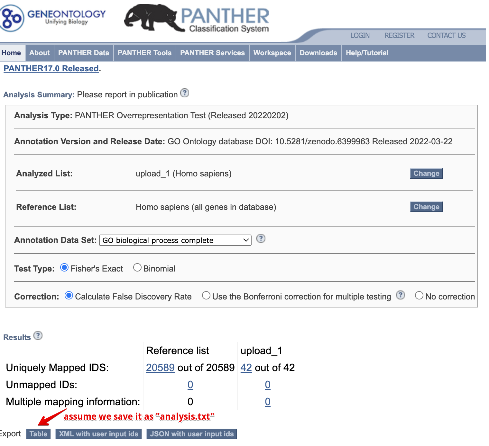
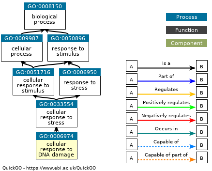
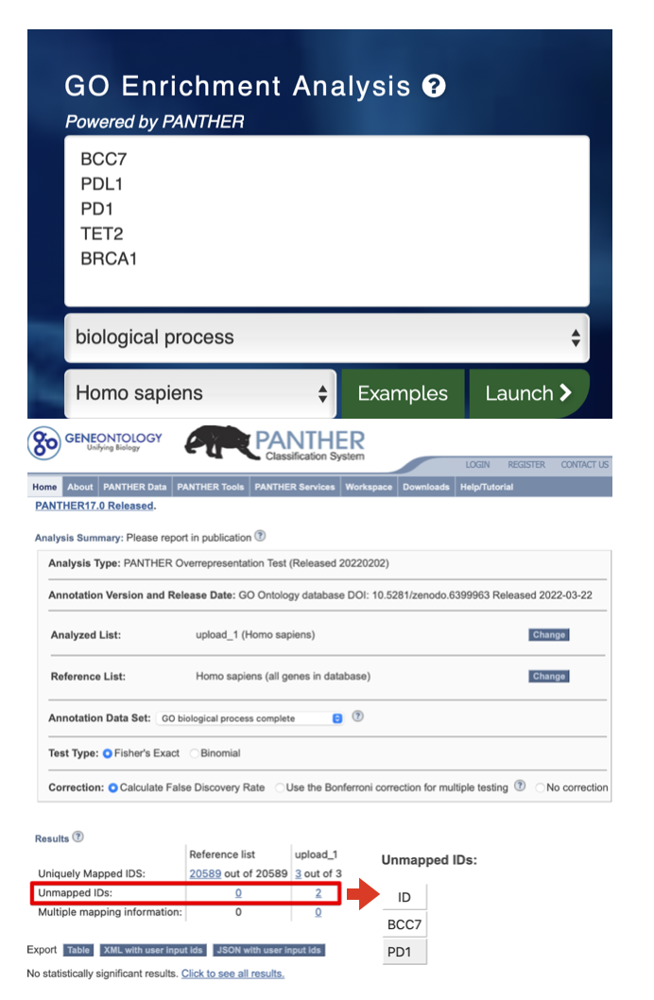

# (PART\*) Part III: Enrichment Analysis {-}

```{r include=FALSE}
library(knitr)
opts_chunk$set(message = FALSE, warning = FALSE, eval = TRUE, echo = TRUE, cache = TRUE)
library(genekitr)
library(dplyr)
```

# ORA GO analysis {#ora-go-analysis-1}

As the paper ["Urgent need for consistent standards in functional enrichment analysis"](https://journals.plos.org/ploscompbiol/article?id=10.1371/journal.pcbi.1009935) mentioned, popular functional enrichment tools can be classified into two main categories: (1) over-representation analysis (ORA) and (2) functional class scoring (FCS) . 

According to paper ["Over-representation of correlation analysis (ORCA): a method for identifying associations between variable sets"](https://academic.oup.com/bioinformatics/article/31/1/102/2365686?login=true):

> Over-representation analysis (ORA) is a simple method for objectively deciding whether a set of variables of known or suspected biological relevance, such as a gene set or pathway, is more prevalent in a set of variables of interest than we expect by chance.

ORA usually has these procedures:

1. Identify features, such as mRNA, proteins or microarray probes, considered "differentially expressed" in two or more conditions
2. Determine the number of differentially expressed features in each pathway
3. For each pathway, using a hypergeometric distribution to calculate a probability value ( P -value) of obtaining the number of differentially expressed features against the background list of all features


## GO intruduction {#go-introduction}

> According to Wikipedia, "Ontologies consist of detectable or directly observable representations of things and the relationships between those things." 

GO is short for [Gene Ontology](http://geneontology.org). GO analysis is to find the associations between gene products and GO terms， which has three domains:

+ Biological Processes (BP)
  - A biological process represents a specific objective that the organism is genetically programmed to achieve.
+ Molecular Functions (MF)
  - A molecular process that can be carried out by the action of a single macromolecular machine, usually via direct physical interactions with other molecular entities.
+ Cellular Components (CC)
  - A location, relative to cellular compartments and structures, occupied by a macromolecular machine when it carries out a molecular function.

GO terms are built in a directed acyclic graph with a parent-child relationship.

> For more comprehensive introduction of GO, you may visit: https://advaitabio.com/faq-items/understanding-gene-ontology/ OR http://geneontology.org/docs/ontology-documentation/

## Basic usage {#go-basic-usage}

> `genGO` is built on `clusterProfiler::enrichGO` and optimizes analysis process to make better understanding. 

The simplest arguments are: 

- `id`: gene id of entrez, ensembl, symbol (alias is also accepted) or uniprot
- `org`: organism (from `genekitr::biocOrg_name`)
- `ont`: ontology of "bp", "mf", "cc" or "all"
- `pvalueCutoff`
- `qvalueCutoff`

```{r}
data(geneList, package = "genekitr")
id <- names(geneList)[abs(geneList) > 2]
ego <- genGO(id,
  org = "human",
  ont = "bp",
  pvalueCutoff = 0.01,
  qvalueCutoff = 0.01
)
head(ego)
```

If user has proteomics data, protein IDs could directly do GO analysis instead of gene conversion.
Here we will use data from: [rat protein example data](#protein-example-data)

```{r include=FALSE}
load("data/rat_pro.rda")
```

```{r}
pro_id <- rat_prodata$Acc
head(pro_id, 10)

rat_ego <- genGO(pro_id[1:100], 
                 org = 'rat', 
                 ont = 'bp',
                 pvalueCutoff = 0.01, 
                 qvalueCutoff = 0.01)

head(rat_ego)
```

Except for the GO enrichment result, protein IDs are also mapped to gene symbols which is easy understanding.


### Additional arguments {#go-additional-arguments}

+ `pAdjustMethod`: choose from "holm", "hochberg", "hommel", "bonferroni", "BH", "BY", "fdr", "none"
+ `minGSSize`: Minimal size of each gene set for analysis. Default is 10. Pathway with less than ten genes will be omitted (e.g. [GO:0062196](http://www.informatics.jax.org/vocab/gene_ontology/GO:0062196) is a child term with 8-gene in the bottom of the directed acyclic graph).
+ `maxGSSize`: Maximal size. Default is 500. The pathway will more than 500 genes will be omitted (e.g. [GO:0007049](http://www.informatics.jax.org/vocab/gene_ontology/GO:0007049) has 1796 genes as parent nodes at the top of the directed acyclic graph). 
+ `universe`: If uses have their background genes, set them as `universe`. Otherwise, the program will take all genes in the `orgDb` annotation package (e.g. `org.Hs.eg.db`).


### New features {#go-new-features}

+ If input id is not a symbol, `genGO` will convert to a symbol for easy understanding.
+ No need to sepcify input id type, `genGO` will allocate automatically.
+ `genGO` sets four measurement aspects: "Count", "GeneRatio", "FoldEnrichment" and "RichFactor".
  - Bg Ratio: Total number of specific pathway gene/ Universal gene numbers (e.g., all human protein-coding genes)
  - Gene Ratio: Genes of interest in specific pathway/gene of interest (e.g., differentially expressed genes)
  - Fold Enrichment:  GeneRatio / BgRatio
  - Rich Factor: Genes of interest in specific pathway/ Total number of specific pathway gene
+ Return as data frame format which is easy to select and export interested pathways

## Group enrichment analysis {#go-group-enrichment}

If there are multi-group comparison (e.g. up and down-regulated genes), user needs to specify gene groups and set them as the `group_list` argument:

### Comparison with one group:

```{r}
id2 <- c(head(names(geneList), 50), tail(names(geneList), 50))
one_group <- list(group1 = c(rep("up", 50), rep("down", 50)))

gego1 <- genGO(id2,
  group_list = one_group,
  org = "human",
  ont = "bp",
  pvalueCutoff = 0.05,
  qvalueCutoff = 0.05
)
head(gego1, 5)
```

### Comparison with more than one group

If there are two group conditions (e.g. up/down regulated; treatment on serial time points), user needs to set two-group list.

```{r}
two_groups <- list(
  exp_group = c(rep("up", 50), rep("down", 50)),
  time_group = c(rep("time1", 40), rep("time2", 60))
)
gego2 <- genGO(id2,
  group_list = two_groups,
  org = "human",
  ont = "bp",
  pvalueCutoff = 0.05,
  qvalueCutoff = 0.05
)
head(gego2, 5)
```


## Advanced usage {#go-advanced-usage}

### Different types of input and backgroud genes

> `genGO` could utilize `transId` to make the same gene type  

In the below example, we will set input id as symbols and background id as Entrez.


```{r}
symbol_id <- transId(id2, transTo = "symbol", unique = T) %>% dplyr::pull(symbol)
symbol_id <- c(symbol_id, "BCC7", "PD1", "PDL1")
head(symbol_id)
head(names(geneList))

diy_ego <- genGO(symbol_id,
  org = "human",
  ont = "bp",
  pvalueCutoff = 0.01,
  qvalueCutoff = 0.01,
  pAdjustMethod = "fdr",
  minGSSize = 5,
  maxGSSize = 2000,
  universe = names(geneList)
)

head(diy_ego, 5)
```

In this result, the input **gene alias is also recognized** and converted to the official symbol (e.g. `BCC7`):

```{r}
diy_ego$geneID[1]
diy_ego$geneID_symbol[1]
```

### Import external data {#go-import}

For now, `genekitr` support importing [panther](http://pantherdb.org/webservices/go/overrep.jsp) result from [GeneOntology](http://geneontology.org/) and formatting as `genGO` result.

(ref:goPantherscap) Import panther result.

(ref:goPanthercap) **Import panther result.**

```{r goPanther, out.width="100%", echo=FALSE, fig.cap="(ref:goPanthercap)", fig.scap="(ref:goPantherscap)"}

```

For example, we save panther result as "analysis.txt" and pass to `importPanther`. It will tidy the data and calculate both fold enrichment and rich factor.

```{r}
panther_res <- importPanther("data/analysis.txt")
head(panther_res, 5)
```

### Simplify GO result {#go-simplify}

`simGO` utilizes `GOSemSim::goSim()` to calculate semantic similarity between two GO terms, then passes to `rrvgo::reduceSimMatrix()` to reduce redundant terms.

Methods of calculating the similarity between nodes: "Resnik", "Lin", "Rel", "Jiang" , "Wang" and "JC" (Jaccard similarity coefficient).

```{r}
sim_go <- simGO(diy_ego,sim_method = 'Wang')
dim(diy_ego);dim(sim_go)
```

Let's look which terms are considered as redundant:

```{r}
head(diy_ego$Hs_BP_ID[!diy_ego$Hs_BP_ID%in%sim_go$Hs_BP_ID])
```

(ref:goSimscap) Term GO:0006974.

(ref:goSimcap) **Term GO:0006974**

```{r goSim, out.width="100%", echo=FALSE, fig.cap="(ref:goSimcap)", fig.scap="(ref:goSimscap)"}

```

The first record [GO:0006974](https://www.ebi.ac.uk/QuickGO/term/GO:0006974) is actually child node of `GO:0033554`, which is remained in `sim_go`.


## Comparison with other tools {#go-tools-comparsion}

### `genGO`  vs `enrichGO`

If input id contains gene alias, `genGO` will invoke `transId` to automatically convert gene alias to symbol for better explanation.


```{r}
check_gene <- c("BCC7", "PDL1", "PD1", "TET2", "BRCA1")

genekitr_res <- genekitr::genGO(check_gene, ont = "bp", org = "hs", 
                                pvalueCutoff = 0.01, qvalueCutoff = 0.01)

clustp_res <- clusterProfiler::enrichGO(check_gene,
  OrgDb = "org.Hs.eg.db",
  keyType = "SYMBOL",
  pvalueCutoff = 0.01,
  qvalueCutoff = 0.01,
  ont = "BP"
) %>% as.data.frame()

dim(genekitr_res)
dim(clustp_res)
```

If you check these two results, you may find that `clustp_res` only contains two genes: `TET2` and `BRCA1`, while `genekitr_res` includes all five genes.

```{r}
head(genekitr_res,5)
head(clustp_res,5)
```

If you look into deeper, you may find six terms are unique in `clustp_res`, such as `GO:0016571`:

```{r}
clustp_res$ID[!clustp_res$ID%in%genekitr_res$Hs_BP_ID ]
```

**Question1: Why some terms are omited in `genGO` result?**

To get adjusted p value, the critical parameter is the number of testing. For simple explaination, `adj.p = f * p (f>1)` and f is related with testing methods and the number of tests.

In the above example, `genGO` recognizes five genes so we need to do five testings while `enrichGO` includes two genes so the testing number will be less. This directly causes `adj.Pvalue` of those "disappeared" terms becomes higher and filtered by cutoff `0.01`.

If we set cutoff higher(e.g. 0.05), then we will still get those terms:

```{r}
genekitr_res2 <- genekitr::genGO(check_gene, ont = "bp", org = "hs", 
                                pvalueCutoff = 0.05, qvalueCutoff = 0.05)

table(clustp_res$ID%in%genekitr_res2$Hs_BP_ID)
```

**Question2: why `enrichGO` only recognize two genes?**

Such gene "BCC7", "PD1" or "PDL1" are essential so they must have related pathways. 

The core reason is they are actually gene aliases but `enrichGO` set argument `keyType = "SYMBOL"` which cause `enrichGO` only accepts official symbols. This function is based on organism annotation package (e.g. `org.Hs.eg.db`) and it accepts different types of data:

```{r}
library(org.Hs.eg.db)
AnnotationDbi::columns(org.Hs.eg.db)
```

Only by specifying `keyType = 'ALIAS'`, this program could recognize gene alias, however it still could not distinguish the mixture of symbol and alias.


### `genGO`  vs `Panther web`

Still using the above five check genes.

Panther could recognize "PDL1" but not "PD1", as well as "BCC7" is omited.

(ref:pantherFailscap) Panther result.

(ref:pantherFailcap) **Panther result**

```{r pantherFail, fig.width=8, fig.height=14,, echo=FALSE, fig.cap="(ref:pantherFailcap)", fig.scap="(ref:pantherFailscap)"}

```


