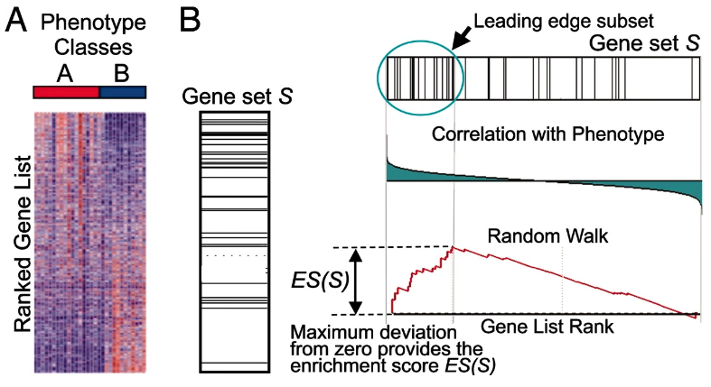

# Functional Class Scoring {#functional-class-scoring}

```{r include=FALSE}
library(knitr)
opts_chunk$set(message=FALSE, warning=FALSE, eval=TRUE, echo=TRUE, cache=TRUE)
library(genekitr)
```

[ORA method](#over-representation-analysis) is easy to conduct, but it will lose information when genes' differences are slight. For example, if a gene is essential in some pathway but is low-expressed, it will be filtered by fold change cutoff.

Unlike [ORA method](#over-representation-analysis), FCS tools do not set a threshold for differentially expressed genes. Instead, it gives each detected gene a differential expression score and then evaluates whether the scores are more positive or negative than expected by chance for each gene set.

FCS approaches include GSEA, Catmap, GlobalTest, sigPathway, SAFE, GSA, Category, PADOG, PCOT2, FunCluster, SAM-GS, etc.

Next, we will go through the popular Gene Set Enrichment Analysis (GSEA) tool, which uses FCS permutation approaches to determine whether a gene set is significantly associated with higher or lower scores.

## GSEA intruduction {#gsea-introduction}

> To do GSEA, you must have an ordered gene rank list (e.g., genes with decreasing logFC order).

There are main three steps to doing GSEA:

1. Calculate the enrichment score (ES): represents the amount to which the genes in the set are over-represented at either the top or bottom of the list. GSEA starts at the top of the ranked gene list to calculate the enrichment score. If a gene is a member of the candidate gene set, it adds to a running sum. Otherwise, it subtracts.

2. Estimate the statistical significance of the ES: this calculation is done by a phenotypic-based permutation test in order to produce a null distribution for the ES.

3. Adjust for multiple hypothesis testing for when a large number of gene sets are being analyzed at one time: the enrichment scores for each set are normalized, and a false discovery rate is calculated.

(ref:gseaoverviewScap) GSEA overview

(ref:gseaoverviewCap) **GSEA overview**

```{r gseaoverview, out.width="100%", echo=FALSE, fig.cap="(ref:gseaoverviewCap)", fig.scap="(ref:gseaoverviewScap)"}

```

> If you are interested in GSEA detailed procedure, please visit: https://www.pathwaycommons.org/guide/primers/data_analysis/gsea

## Basic usage {#gsea-basic-usage}

> `genKEGG` is built on `clusterProfiler::GSEA` and `msigdbr`

The simplest arguments are: 

- `genelist`: Order ranked genelist in decreasing order, gene can be entrez, ensembl or symbol.
- `org`: organism (from `genekitr::msig_org`)
- `category`: one of C1','C2','C3', 'C4','C5','C6','C7','C8','H'
- `subcategory`: choose from `genekitr::msig_category`. If no subcategory, leave it as NULL.
- `pvalueCutoff`
- `qvalueCutoff`

[Msigdb categories](http://www.gsea-msigdb.org/gsea/msigdb/collections.jsp) have 9 major collections and several sub-collections from 32880 gene sets: 
+ H: hallmark gene sets
+ C1: positional gene sets
+ C2: curated gene sets
+ C3: regulatory target gene sets
+ C4: computational gene sets
+ C5: ontology gene sets
+ C6: oncogenic signature gene sets
+ C7: immunologic signature gene sets
+ C8: cell type signature gene sets

```{r gsea-basic-usage}
data(geneList, package = "genekitr")
gse <- genGSEA(genelist = geneList, 
               org = "human",
               category = "H",
               use_symbol = TRUE)
class(gse)
names(gse)
```

The GSEA result is a list mainly including input genelist, target gene set and result.

```{r gsea-check-result}
head(gse$genelist) 
head(gse$geneset) 
head(gse$gsea_df,5)
```


