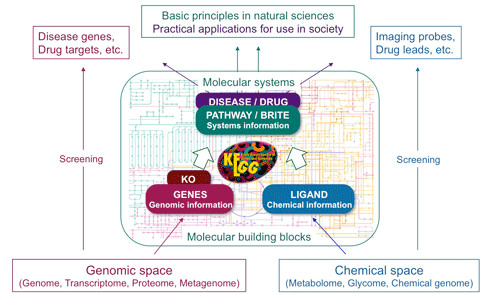

# ORA KEGG analysis {#ora-kegg-analysis-1}

```{r include=FALSE}
library(knitr)
opts_chunk$set(message = FALSE, warning = FALSE, eval = TRUE, echo = TRUE, cache = TRUE)
library(genekitr)
```

## KEGG intruduction {#kegg-introduction}

KEGG is short for "Kyoto Encyclopedia of Genes and Genomes," a collection of databases dealing with genomes, biological pathways, diseases, drugs, and chemical substances.

The pathway maps are classified into the following sections:

1. Metabolism
2. Genetic information processing (transcription, translation, replication and repair, etc.)
3. Environmental information processing (membrane transport, signal transduction, etc.)
4. Cellular processes (cell growth, cell death, cell membrane functions, etc.)
5. Organismal systems (immune system, endocrine system, nervous system, etc.)
6. Human diseases
7. Drug development

(ref:keggoverviewScap) KEGG overview.

(ref:keggoverviewCap) **KEGG overview.** Figure taken from <https://paintomics.readthedocs.io/en/stable/1_kegg/>.

```{r keggoverview, out.width="100%", echo=FALSE, fig.cap="(ref:keggoverviewCap)", fig.scap="(ref:keggoverviewScap)"}

```


## Basic usage {#kegg-basic-usage}

> `genKEGG` is built on `clusterProfiler::enrichKEGG` and optimizes analysis process to make better understanding. 

The simplest arguments are: 

- `id`: gene id of entrez (numeric id is also supported), ensembl or symbol (alias is also accepted)
- `org`: organism (7254 species from `genekitr::keggOrg_name`)
- `pvalueCutoff`
- `qvalueCutoff`

```{r}
data(geneList, package = "genekitr")
id <- names(geneList)[abs(geneList) > 1]
keg <- genKEGG(id,
  org = "human",
  pvalueCutoff = 0.05,
  qvalueCutoff = 0.05
)
head(keg, 5)
```

Input type is not limited to Entrez ID, other gene types will be automatically converted to Entrez ID.

```{r}
sym <- c("TP53","BRCA1", "PD1", "PDL1","BRCA2","TET2")
keg2 <- genKEGG(sym,
  org = "human",
  pvalueCutoff = 0.05,
  qvalueCutoff = 0.05
)
head(keg2, 5)
```


## Group enrichment {#kegg-group-enrichment}

Like [GO enrichment analysis](#go-group-enrichment), KEGG also supports multi-group gene enrichment analysis.

```{r}
id2 <- c(head(names(geneList), 100), tail(names(geneList), 100))
group <- list(
  group1 = c(rep("up", 100), rep("down", 100)),
  group2 = c(rep("A", 130), rep("B", 70))
)
gkeg <- genKEGG(id2,
  group_list = group,
  org = "human",
  pvalueCutoff = 0.05,
  qvalueCutoff = 0.05
)
head(gkeg, 5)
```

Other additional arguments could refer to [GO analysis](#go-additional-arguments).


