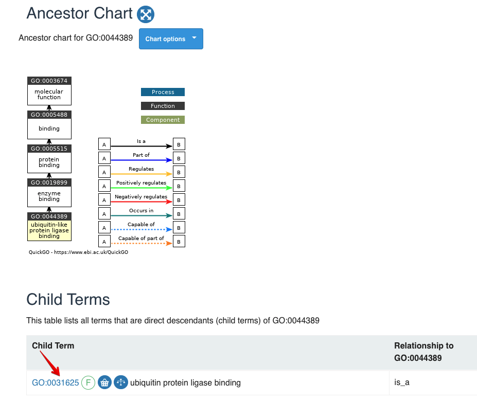

# ORA analysis {#ora-analysis-1}

```{r include=FALSE}
library(knitr)
opts_chunk$set(message = FALSE, warning = FALSE, eval = TRUE, echo = TRUE, cache = TRUE)
library(genekitr)
```


As the paper ["Urgent need for consistent standards in functional enrichment analysis"](https://journals.plos.org/ploscompbiol/article?id=10.1371/journal.pcbi.1009935) mentioned, popular functional enrichment tools can be classified into two main categories: (1) over-representation analysis (ORA) and (2) functional class scoring (FCS) . 

> **Knidly Note:** No matter which method you choose, the first thing is always the preparation of gene sets.

## ORA method introduction {#ora-introduction}

According to paper ["Over-representation of correlation analysis (ORCA): a method for identifying associations between variable sets"](https://academic.oup.com/bioinformatics/article/31/1/102/2365686?login=true):

> Over-representation analysis (ORA) is a simple method for objectively deciding whether a set of variables of known or suspected biological relevance, such as a gene set or pathway, is more prevalent in a set of variables of interest than we expect by chance.

ORA usually has these procedures:

1. Identify features, such as mRNA, proteins or microarray probes, considered "differentially expressed" in two or more conditions
2. Determine the number of differentially expressed features in each pathway
3. For each pathway, using a hypergeometric distribution to calculate a probability value ( P -value) of obtaining the number of differentially expressed features against the background list of all features


## Basic usage {#ora-basic-usage}

The simplest arguments are: 

- `id`: gene id of Entrez (numeric id is also supported), Ensembl, Symbol (alias is also accepted) or Uniprot 
- `geneset`: gene set is a two-column data frame with term id and gene id. (It's recommended to use `r CRANpkg("geneset")`)
- `p_cutoff`: numeric of cutoff for both pvalue and adjusted pvalue, default is 0.05.
- `q_cutoff`: numeric of cutoff for qvalue, default is 0.15.


### 1st step: prepare input IDs

To show the various input ID types, we choose Entrez ID, Symbol from human and Uniprot from [rat protein example data](#protein-example-data).

```{r include=FALSE}
load("data/rat_pro.rda")
```

```{r}
data(geneList, package = "genekitr")
entrez_id <- names(geneList)[abs(geneList) > 2]
head(entrez_id, 5)

symbol_id <-  c("TP53","BRCA1","TET2") # all official symbols
mix_symbol_id <-  c("BCC7","BRCA1","TET2") # mixture of official symbol and alias

unip_id <- rat_prodata$Acc[1:100]
head(unip_id, 5)
```

### 2nd step: prepare gene set

> For more details, please refer to [chapter7](#get-gene-sets-1)

Here we prepare GO MF gene set:

```{r}
hg_gs <- geneset::getGO(org = "human",ont = "mf")
rat_gs <- geneset::getGO(org = "rat",ont = "mf")
```

### 3rd step: ORA analysis

For non-symbol genes (e.g. Entrez IDs): 

```{r}
go_ent <- genORA(entrez_id, geneset = hg_gs)
head(go_ent)
```

For symbol genes without alias: 

```{r}
go_sym <- genORA(symbol_id, geneset = hg_gs)
head(go_sym)
```

For symbol genes with alias: 

```{r}
go_sym_mix <- genORA(mix_symbol_id, geneset = hg_gs)
head(go_sym_mix)
```


For Uniprot proteins: 
```{r}
go_unip <- genORA(unip_id, geneset = rat_gs)
head(go_unip)
```

### Some features

We could get conclude some features through examples above:

+ No need to sepcify input ID type and organism. The genekitr will automatically detect organism name and convert ID to suitable one.
+ Return a data.frame object which is easy to filter or export
+ Non-symbol IDs will be automatically converted to the latest gene symbol to easily understand
+ If input symbols are mixed with aliases, a new column "geneID_symbol" will be added; if all symbols are official, only "geneID" column will return
+ `genORA()` includes five gene-level measurement: "Count", "BgRatio","GeneRatio", "FoldEnrichment" and "RichFactor".
  - `BgRatio`: Number of all genes in specific term / Number of universal genes (if not specified, is all genes in gene set)
  - `GeneRatio`: Number of genes enriched in specific term / Number of input genes
  - `FoldEnrichment`:  GeneRatio / BgRatio
  - `RichFactor`: Number of genes enriched in specific term / Number of all genes in specific term

## Advanced usage {#ora-advanced-usage}

### Additional arguments {#ora-additional-arguments}

+ `pAdjustMethod`: choose from "holm", "hochberg", "hommel", "bonferroni", "BH", "BY", "fdr", "none"
+ `min_gset_size`: Minimal size of each gene set for analysis. Default is 10. Pathway with less than ten genes will be omitted (e.g. [GO:0062196](http://www.informatics.jax.org/vocab/gene_ontology/GO:0062196) is a child term with 8-gene in the bottom of the directed acyclic graph).
+ `max_gset_size`: Maximal size. Default is 500. The pathway will more than 500 genes will be omitted (e.g. [GO:0007049](http://www.informatics.jax.org/vocab/gene_ontology/GO:0007049) has 1796 genes as parent nodes at the top of the directed acyclic graph). 
+ `universe`: If uses have their background genes, set them as `universe`. If missing, all genes in the  geneset will be used as background universe.

### Group enrichment {#ora-group-enrichment}

If there is multi-group comparison (e.g. multiple experimental conditions or multiple time points), user could specify gene groups as the `group_list` argument:

For example, we have 100 genes:

- 50/100 genes are up-regulated and 50/100 are down-regulated
- 40/100 genes are detected at time point 1 and 60/100 are detected at time point 2


```{r}
id_100 <- c(head(names(geneList), 50), tail(names(geneList), 50))
two_groups <- list(
  exp_group = c(rep("up", 50), rep("down", 50)),
  time_group = c(rep("time1", 40), rep("time2", 60))
)

gora <- genORA(id_100, geneset = gs, group_list = two_groups)
head(gora)
table(gora[,1])
```


### Add background genes {#ora-background}

With the help of `transId()`, background genes could be different type from input IDs. 

For example, the input genes are symbols while the background genes are Entrez.

```{r}
head(names(geneList))
go_bkg <- genORA(symbol_id, geneset = hg_gs, universe = names(geneList))
```


### **[GO specific]** Simplify GO ORA result {#ora-go-simplify}

To improve GO term simplifying performance, genekitr extracts species-specific **GO term** information from Bioconductor organism-level annotation packages for fifteen species, including human, mouse, rat, fly, thale cress, yeast, zebrafish, worm, bovine, pig, chicken, mosquito, dog, frog, and chimpanzee. 

Then genekitr obtains the **ancestors** of GO terms and their relations from `r Biocpkg("GO.db")` 

To **calculate semantic similarity** for GO BP, CC and MF, genekitr utilizes five algorithms ('Resnik', 'Lin', 'Jiang', 'Rel' and 'Wang')  from `r Biocpkg("GOSemSim")` 

```{r}
sim_go <- simGO(go_sym,sim_method = 'Resnik')
dim(go_sym);dim(sim_go)
```

Let's look which terms are considered as redundant:

```{r}
head(go_sym$Hs_MF_ID[!go_sym$Hs_MF_ID%in%sim_go$Hs_MF_ID])
```

(ref:goSimscap) Term GO:0044389.

(ref:goSimcap) **Term GO:0044389**

```{r goSim, out.width="100%", echo=FALSE, fig.cap="(ref:goSimcap)", fig.scap="(ref:goSimscap)"}

```

The first record [GO:0044389](https://www.ebi.ac.uk/QuickGO/term/GO:0044389) has the child term of [GO:0031625](https://www.ebi.ac.uk/QuickGO/term/GO:0031625), so we only remain the child.


## Comparison with other tools {#ora-tools-comparsion}

### `genekitr::genORA`  vs `clusterProfiler::enrichGO/enrichKEGG/enrichDO...`

The function `genORA` does not require to load the `orgdb` ahead and no need to specify input ID type.

Next, take GO analysis as example:

The input IDs are mixture of official symbols and aliases. Also all the five genes are very popular in biomedical research.

```{r}
check_gene <- c("BCC7", "PDL1", "PD1", "TET2", "BRCA1")

# Genekitr
start = Sys.time()
gs <- geneset::getGO(org = "human",ont = "bp")
genekitr_res <- genekitr::genORA(check_gene, gs, p_cutoff = 0.01, q_cutoff = 0.01)
end = Sys.time()
(end-start)

# clusterProfiler
start = Sys.time()
require(org.Hs.eg.db)
clustp_res <- clusterProfiler::enrichGO(check_gene,
                                        OrgDb = "org.Hs.eg.db",
                                        keyType = "SYMBOL",
                                        pvalueCutoff = 0.01,
                                        qvalueCutoff = 0.01,
                                        ont = "BP")
end = Sys.time()
(end-start)
```

Then check the result:

```{r}
class(genekitr_res)
class(clustp_res)
isS4(clustp_res)

# we need to convert the S4 to dataframe to view
clustp_res2 <- as.data.frame(clustp_res)

dim(genekitr_res)
dim(clustp_res2)

head(genekitr_res,5)
head(clustp_res,5)
```

- `clustp_res` only contains two genes: `TET2` and `BRCA1` 
- `genekitr_res` includes all five genes and gives mapping for aliases


If you look into deeper, you may find eight terms are unique in `clustp_res`, such as `GO:0016571`:

```{r}
clustp_res$ID[!clustp_res$ID%in%genekitr_res$Hs_BP_ID ]
```

**Question1: Why some terms are omited in `genGO` result?**

To get adjusted p value, the critical parameter is the number of statistical testing. 

For simple explanation, `adj.p = f * p (f>1)` and f is related with testing methods and the number of tests. `genORA` recognizes five genes so we need to do more testings (for example, we do five testings) while `enrichGO` only includes two genes so the testing number will be less. This directly reduces the `adj.p` in `enrichGO` result and it could be remained under the threshold 0.01.


So, if we set cutoff higher(e.g. 0.05), genekitr could also get those terms:

```{r}
genekitr_res2 <- genekitr::genORA(check_gene, gs, p_cutoff = 0.05, q_cutoff = 0.05)

table(clustp_res$ID%in%genekitr_res2$Hs_BP_ID)
```

**Question2: Why `enrichGO` only recognize two genes?**

We all know that it is not possible for such essential genes ("BCC7", "PD1" or "PDL1") without enriched terms.

The core reason is that the three genes are actually aliases while `enrichGO` sets argument `keyType = "SYMBOL"`, which cause `enrichGO` only accepts official symbols. This function is based on organism annotation package (e.g. `org.Hs.eg.db`) and it will accept different types of data from `org.Hs.eg.db`:

```{r}
library(org.Hs.eg.db)
AnnotationDbi::columns(org.Hs.eg.db)
```

Only by specifying `keyType = 'ALIAS'`, the program could recognize gene alias, however it still could not distinguish the mixture of symbol and alias.


### `genGO`  vs `Panther web`

Still using the above five check genes.

Panther could recognize "PDL1" but not "PD1", as well as "BCC7" is omited.

(ref:pantherFailscap) Panther result.

(ref:pantherFailcap) **Panther result**

```{r pantherFail, fig.width=8, fig.height=14,, echo=FALSE, fig.cap="(ref:pantherFailcap)", fig.scap="(ref:pantherFailscap)"}
knitr::include_graphics("figures/panther_fail_exp.png")
```


