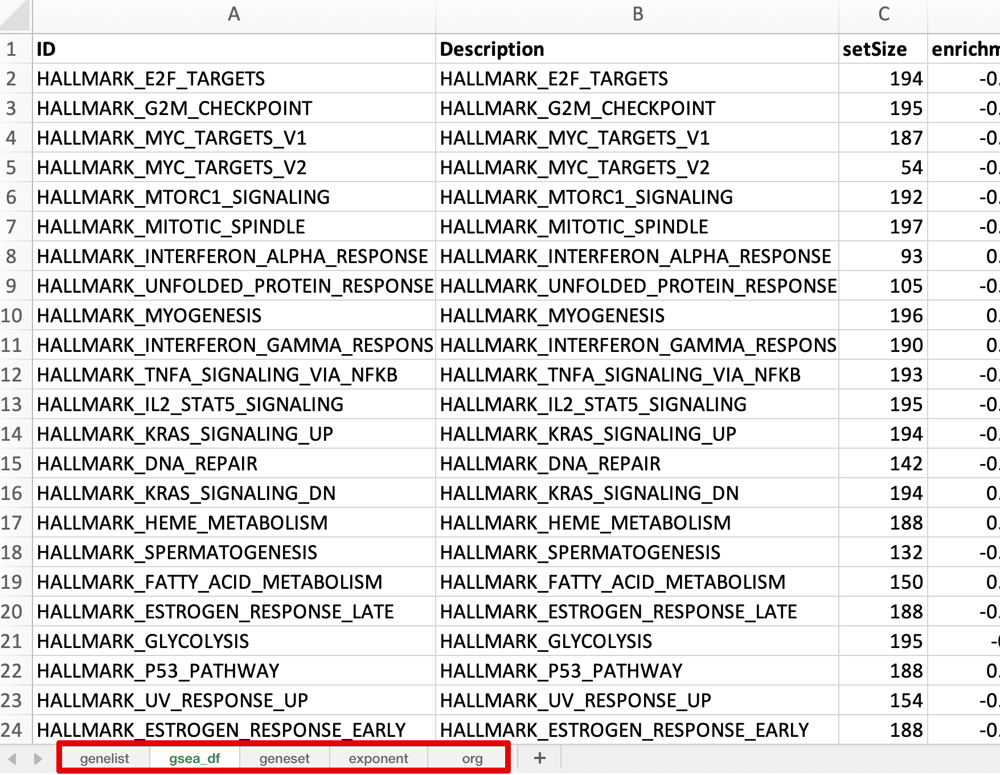

# Functional Class Scoring {#functional-class-scoring-1}

```{r include=FALSE}
library(knitr)
opts_chunk$set(message = FALSE, warning = FALSE, eval = TRUE, echo = TRUE, cache = TRUE)
library(genekitr)
```

## FCS method introduction {#fcs-introduction}

[ORA method](#ora-introduction) is easy to conduct, but it will lose information when genes' differences are slight. For example, if a gene is essential in some pathway but is low-expressed, it will be filtered by fold change cutoff.

Unlike ORA, FCS tools do not set a threshold for differentially expressed genes. Instead, it gives each detected gene a differential expression score and then evaluates whether the scores are more positive or negative than expected by chance for each gene set.

> According to article "[Ten Years of Pathway Analysis: Current Approaches and Outstanding Challenges](https://www.ncbi.nlm.nih.gov/pmc/articles/PMC3285573/)":

FCS approaches include [GSEA](https://www.gsea-msigdb.org/), [GlobalTest](https://www.ncbi.nlm.nih.gov/pmc/articles/PMC2712740/), [sigPathway](https://pubmed.ncbi.nlm.nih.gov/16174746), [SAFE](https://pubmed.ncbi.nlm.nih.gov/15647293), [GSA](https://scholar.google.com/scholar_lookup?journal=Ann+Appl+Stat&title=On+testing+the+significance+of+sets+of+genes&author=B+Efron&author=R+Tibshirani&volume=1&publication_year=2007&pages=107-129&), [PADOG](https://pubmed.ncbi.nlm.nih.gov/22713124), [PCOT2](https://pubmed.ncbi.nlm.nih.gov/16877751), [FunCluster](https://pubmed.ncbi.nlm.nih.gov/17007070), [SAM-GS](https://pubmed.ncbi.nlm.nih.gov/17612399), [Category](https://pubmed.ncbi.nlm.nih.gov/17127676) etc.

Next, we will go through the popular Gene Set Enrichment Analysis (GSEA) tool, which uses FCS permutation approaches to determine whether a gene set is significantly associated with higher or lower scores.

## GSEA intruduction {#gsea-introduction}

> To do GSEA, user must have an ordered gene rank list (e.g., genes with decreasing logFC order).

Three steps in GSEA:

1. Calculate the enrichment score (ES): represents the amount to which the genes in the set are over-represented at either the top or bottom of the list. GSEA starts at the top of the ranked gene list to calculate the enrichment score. If a gene is a member of the candidate gene set, it adds to a running sum. Otherwise, it subtracts.

2. Estimate the statistical significance of the ES: this calculation is done by a phenotypic-based permutation test in order to produce a null distribution for the ES.

3. Adjust for multiple hypothesis testing for when a large number of gene sets are being analyzed at one time: the enrichment scores for each set are normalized, and a false discovery rate is calculated.

(ref:gseaoverviewScap) GSEA overview

(ref:gseaoverviewCap) **GSEA overview**

```{r gseaoverview, out.width="100%", echo=FALSE, fig.cap="(ref:gseaoverviewCap)", fig.scap="(ref:gseaoverviewScap)"}
knitr::include_graphics("figures/gsea_overview.png")
```

> If you are interested in GSEA detailed procedure, please visit: https://www.pathwaycommons.org/guide/primers/data_analysis/gsea OR https://github.com/crazyhottommy/RNA-seq-analysis/blob/master/GSEA_explained.md


## Basic usage {#gsea-basic-usage}

The simplest arguments are: 

- `id`: pre-ranked genelist with decreasing order (e.g. logFC order/correlation order). Entrez, Ensembl and Symbol are accepted 
- `geneset`: gene set is a two-column data frame with term id and gene id. (It's recommended to use `r CRANpkg("geneset")`)
- `p_cutoff`: numeric of cutoff for both pvalue and adjusted pvalue, default is 0.05.
- `q_cutoff`: numeric of cutoff for qvalue, default is 0.15.


### 1st step: prepare pre-ranked gene list

```{r}
data(geneList, package = "genekitr")
head(geneList)
```

### 2nd step: prepare gene set

```{r}
gs <- geneset::getGO(org = "human",ont = "mf")
```

### 3rd step: GSEA analysis

```{r}
gse <- genGSEA(genelist = geneList, geneset = gs)
```

Now, let's look at the result:

It is a list mainly including analysis result (`gsea_df`), input genelist (`genelist`) and input geneset (`geneset`). 

```{r}
class(gse)
names(gse)
head(gse$genelist)
head(gse$geneset)
head(gse$gsea_df, 5)
```


> About the `gsea_df` result

+ `Description`: Gene set name 

+ `setSize`: number of genes with gene-level statistic values. To be more specific, if we input a pathway gene set with 58 genes (e.g. HALLMARK_MYC_TARGETS_V2 ), while our gene list only have 54 of it, so the result will only show setSize = 54 

+ `enrichmentScore`: also called ES, same as in Broad GSEA implementation. It reflects the degree to which a gene set is overrepresented at the top or bottom of a ranked list of genes. 

+ `NES`: normalized enrichment score is the primary statistic for examining gene set enrichment results. By normalizing the enrichment score, GSEA accounts for differences in gene set size and in correlations between gene sets and the expression dataset. Therefore, NES can be used to compare analysis results across gene sets. A positive normalized enrichment scores (NES) will indicate that genes in set S will be mostly represented at the top of your list (logFC > 0 or up-regulated genes). 

+ `rank`: The position in the ranked list at which the maximum enrichment score occurred. If gene sets achieve the maximum enrichment score near the top or bottom of the ranked list, the rank at max is either very small or very large.

+ `leading_edge`: includes three statistics 
  - `tags`: The percentage of gene hits before (for positive ES) or after (for negative ES) the peak in the running enrichment score, which indicates the percentage of genes contributing to the enrichment score.
  - `list`: The percentage of genes in the ranked gene list before (for positive ES) or after (for negative ES) the peak in the running enrichment score. This gives an indication of where in the list the enrichment score is attained.
  - `signal`:  If the gene set is entirely within the first N positions in the list, then the signal strength is maximal or 100%. If the gene set is spread throughout the list, then the signal strength decreases towards 0%.

- `geneID & geneID_symbol`: If input symbols are mixed with aliases, a new column "geneID_symbol" will be added; if all symbols are official, only "geneID" column will return

## Advanced usage

### Additional arguments 

Please refer to [ORA part](#ora-additional-arguments)

### Simplify GO GSEA result

Please refer to [ORA part](#ora-go-simplify)


## Export GSEA result

`Genekitr` provides an easy way to export analysis result for editing and sharing. 

Multiple data are saved as different sheets in one excel file. Besides, column names are automatically formatted with bold style.

```{r eval=FALSE}
genekitr::expoSheet(data_list = gse,
                    data_name = names(gse),
                    filename = "gsea_result.xlsx",
                    dir = "./")
```

(ref:exposheetScap) Export result

(ref:exposheetCap) **Export result**

```{r exposheet, out.width="100%", echo=FALSE, fig.cap="(ref:exposheetCap)", fig.scap="(ref:exposheetScap)"}

```

