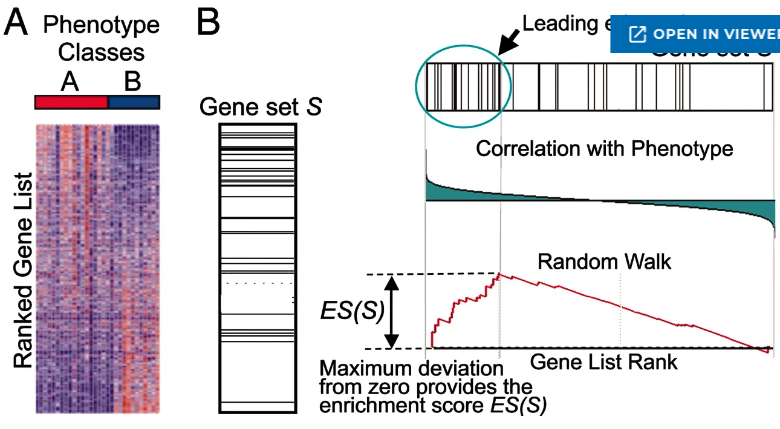
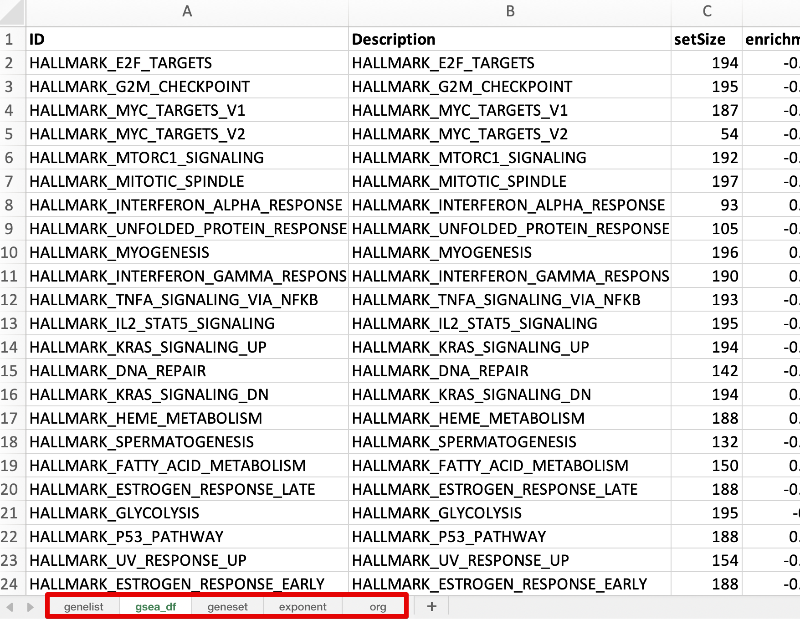

# FCS-GSEA analysis {#functional-class-scoring-1}

```{r include=FALSE}
library(knitr)
opts_chunk$set(message = FALSE, warning = FALSE, eval = TRUE, echo = TRUE, cache = TRUE)
library(genekitr)
```

## Introduction to FCS methods {#fcs-introduction}

The [ORA method](#ora-introduction) is easy to use, but it may lose useful information when the differences between genes are small. For example, a gene may play an essential role in a pathway but still be filtered out by the fold-change cutoff if its expression change is small.

Unlike ORA, FCS tools do not use a fixed threshold to select differentially expressed genes. Instead, they assign a differential expression score to each detected gene and then evaluate whether the scores in each gene set are more positive or negative than expected by chance.

> According to the article "[Ten Years of Pathway Analysis: Current Approaches and Outstanding Challenges](https://www.ncbi.nlm.nih.gov/pmc/articles/PMC3285573/)":

FCS approaches include [GSEA](https://www.gsea-msigdb.org/), [GlobalTest](https://www.ncbi.nlm.nih.gov/pmc/articles/PMC2712740/), [sigPathway](https://pubmed.ncbi.nlm.nih.gov/16174746), [SAFE](https://pubmed.ncbi.nlm.nih.gov/15647293), [GSA](https://scholar.google.com/scholar_lookup?journal=Ann+Appl+Stat&title=On+testing+the+significance+of+sets+of+genes&author=B+Efron&author=R+Tibshirani&volume=1&publication_year=2007&pages=107-129&), [PADOG](https://pubmed.ncbi.nlm.nih.gov/22713124), [PCOT2](https://pubmed.ncbi.nlm.nih.gov/16877751), [FunCluster](https://pubmed.ncbi.nlm.nih.gov/17007070), [SAM-GS](https://pubmed.ncbi.nlm.nih.gov/17612399), and [Category](https://pubmed.ncbi.nlm.nih.gov/17127676), among others.

Next, we will walk through the popular Gene Set Enrichment Analysis (GSEA) method, which uses permutation-based testing to determine whether a gene set is significantly associated with higher or lower scores.

## Introduction to GSEA {#gsea-introduction}

> To perform GSEA, you need an ordered, pre-ranked gene list, such as genes ranked by decreasing logFC values.

GSEA generally includes three steps:

1. Calculate the enrichment score (ES). The ES indicates how strongly the genes in a gene set are overrepresented at either the top or the bottom of the ranked list. GSEA starts at the top of the list and calculates a running sum. The score increases when a gene belongs to the target gene set and decreases when it does not.

2. Estimate the statistical significance of the ES. This is done with a permutation test, which generates a null distribution for the ES.

3. Adjust for multiple testing when many gene sets are analyzed at the same time. The enrichment score of each gene set is normalized, and a false discovery rate is calculated.

(ref:gseaoverviewScap) GSEA overview

(ref:gseaoverviewCap) **GSEA overview**

```{r gseaoverview, out.width="100%", echo=FALSE, fig.cap="(ref:gseaoverviewCap)", fig.scap="(ref:gseaoverviewScap)"}

```

> For a more detailed explanation of the GSEA procedure, please visit https://www.pathwaycommons.org/guide/primers/data_analysis/gsea or https://github.com/crazyhottommy/RNA-seq-analysis/blob/master/GSEA_explained.md.


## Basic usage {#gsea-basic-usage}

The main arguments are:

- `id`: a pre-ranked gene list in decreasing order, such as a list ranked by logFC or correlation. Entrez IDs, Ensembl IDs, and gene symbols are accepted.
- `geneset`: a two-column data frame containing term IDs and gene IDs. We recommend using `r CRANpkg("geneset")` to prepare gene sets.
- `p_cutoff`: a numeric cutoff for both the p-value and adjusted p-value. The default is 0.05.
- `q_cutoff`: a numeric cutoff for the q-value. The default is 0.15.


### Step 1: Prepare a pre-ranked gene list

```{r}
data(geneList, package = "genekitr")
head(geneList)
```

### Step 2: Prepare a gene set

```{r}
gs <- geneset::getGO(org = "human",ont = "mf")
```

### Step 3: Run GSEA

```{r}
gse <- genGSEA(genelist = geneList, geneset = gs)
```

Now, let's take a look at the result.

The returned object is a list that mainly contains the analysis results (`gsea_df`), the input gene list (`genelist`), and the input gene set (`geneset`).

```{r}
class(gse)
names(gse)
head(gse$genelist)
head(gse$geneset)
head(gse$gsea_df, 5)
```


> About the `gsea_df` result

+ `Description`: the name of the gene set.

+ `setSize`: the number of genes in the gene set that have gene-level statistic values in the input list. For example, a pathway gene set may contain 58 genes, such as `HALLMARK_MYC_TARGETS_V2`, but only 54 of them may be present in the input gene list. In this case, the result will show `setSize = 54`.

+ `enrichmentScore`: also called ES, as in the Broad GSEA implementation. It reflects the degree to which a gene set is overrepresented at the top or bottom of a ranked gene list.

+ `NES`: the normalized enrichment score and the primary statistic used to examine gene set enrichment results. By normalizing the enrichment score, GSEA accounts for differences in gene set size and correlations between gene sets and the expression dataset. Therefore, NES values can be used to compare results across gene sets. A positive NES indicates that the genes in set S are mainly found near the top of the ranked list, which usually corresponds to genes with `logFC > 0` or upregulated genes.

+ `rank`: the position in the ranked list where the maximum enrichment score occurs. If a gene set reaches its maximum enrichment score near the top or bottom of the ranked list, the rank at the maximum will be either very small or very large.

+ `leading_edge`: contains three statistics:
  - `tags`: the percentage of gene hits that appear before the peak for a positive ES or after the peak for a negative ES. It indicates the proportion of genes that contribute to the enrichment score.
  - `list`: the percentage of genes in the ranked list that appear before the peak for a positive ES or after the peak for a negative ES. It gives an idea of where the enrichment score is reached in the list.
  - `signal`: the strength of the enrichment signal. If the entire gene set appears within the first N positions of the list, the signal is strongest and may reach 100%. If the genes are spread throughout the list, the signal decreases toward 0%.

- `geneID` and `geneID_symbol`: if the input contains a mixture of official gene symbols and aliases, a new `geneID_symbol` column will be added. If all input symbols are official gene symbols, only the `geneID` column will be returned.

## Advanced usage

### Additional arguments

Please refer to the [ORA section](#ora-additional-arguments).

### Simplify GO GSEA results

Please refer to the [ORA section](#ora-go-simplify).


## Export GSEA results

`genekitr` provides an easy way to export analysis results for further editing and sharing.

Multiple data frames are saved as separate sheets in a single Excel file, and the column names are automatically formatted in bold.

```{r eval=FALSE}
genekitr::expoSheet(data_list = gse,
                    data_name = names(gse),
                    filename = "gsea_result.xlsx",
                    dir = "./")
```

(ref:exposheetScap) Export results

(ref:exposheetCap) **Export results**

```{r exposheet, out.width="100%", echo=FALSE, fig.cap="(ref:exposheetCap)", fig.scap="(ref:exposheetScap)"}

```
