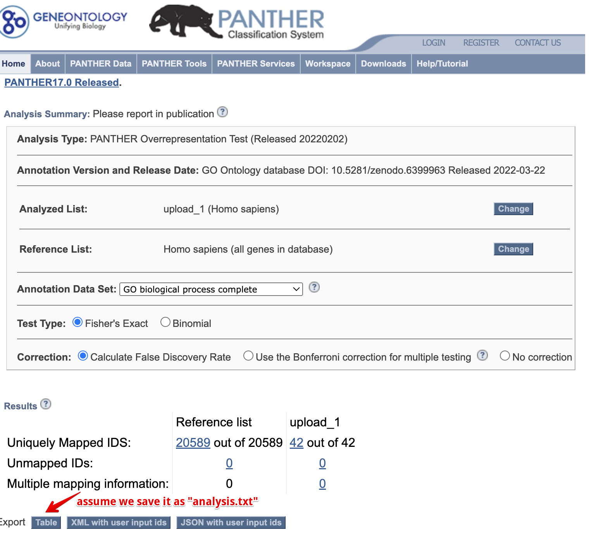

# Import external data {#import-external-data-1}

```{r include=FALSE}
library(knitr)
library(ggplot2)
opts_chunk$set(message = FALSE, warning = FALSE, eval = TRUE, echo = TRUE, cache = TRUE)
library(genekitr)
```


## Import GO PANTHER {#import-panther}

`genekitr::importPanther()` supports importing [PANTHER](http://pantherdb.org/webservices/go/overrep.jsp) results from [GeneOntology](http://geneontology.org/) and formatting them as a `genORA`-style result.

(ref:goPantherscap) Import PANTHER result.

(ref:goPanthercap) **Import PANTHER result.**

```{r goPanther, out.width="100%", echo=FALSE, fig.cap="(ref:goPanthercap)", fig.scap="(ref:goPantherscap)"}

```

For example, we save the PANTHER result as "analysis.txt" and pass it to `importPanther`. It will tidy the data and calculate both fold enrichment and rich factor.

```{r}
panther_res <- importPanther("data/analysis.txt")
head(panther_res, 5)
```

Then, you can select the terms of interest and utilize the plot functions in [Chapter 11](#plot-go-kegg-1).

For example:

(ref:impPantherScap) Bar plot of PANTHER result.

(ref:impPantherCap) **Bar plot of PANTHER result.** 

```{r impPanther, fig.width=8, fig.height=6, fig.cap="(ref:impPantherCap)", fig.scap="(ref:impPantherScap)", dpi=300}
plotEnrich(panther_res[c(50,100,350,580,700),], 
           plot_type = "bar",
           stats_metric = "qvalue", 
           term_metric = "GeneRatio",
           main_text_size = 13,
           legend_text_size = 10
           )
```

## Import clusterProfiler object {#import-clusterProfiler}

`r Biocpkg("clusterProfiler")` is a popular R package for enrichment analysis. However, it requires users to have some programming skills to work with its S4 object, which can be inconvenient for data cleaning and visualization.

Here, `genekitr::importCP()` can easily import the S4 object along with additional attributes (e.g. FoldEnrich, RichFactor) to help users interact with the data more fluently.

### clusterProfiler ORA-GO result

```{r}
## example data
library(clusterProfiler)
library(org.Hs.eg.db)
data(geneList, package="DOSE")
gene <- names(geneList)[abs(geneList) > 2]

## GO result from clusterProfiler
go <- enrichGO(gene          = gene,
                OrgDb         = org.Hs.eg.db,
                ont           = "BP",
                pAdjustMethod = "BH",
                pvalueCutoff  = 0.01,
                qvalueCutoff  = 0.05)

isS4(go) # return a S4 object

## import 
go_easy <- importCP(go, type = "go")
is.data.frame(go_easy)
# keep the same as the original result
identical(as.data.frame(go)[,1], go_easy[,1])

head(go_easy)
```

Then you can select the terms of interest and utilize the plot functions in [Chapter 11](#plot-go-kegg-1).

For example:

(ref:impCPGOScap) Chord plot of clusterProfiler result.

(ref:impCPGOCap) **Chord plot of clusterProfiler result.** 

```{r impCPGO, fig.height=10, fig.width=15, fig.cap="(ref:impCPGOCap)", fig.scap="(ref:impCPGOScap)", dpi=300}
plotEnrich(tail(go_easy,20), 
           plot_type = "genechord", 
           show_gene = c("UBE2C", "CDC20", "NDC80"),
           main_text_size = 10,
           legend_text_size = 10
           )
```

### clusterProfiler GSEA result

```{r}
library(org.Hs.eg.db)
data(geneList, package="DOSE")
## GSEA result from clusterProfiler
kk <- gseGO(geneList     = geneList,
               OrgDb         = org.Hs.eg.db,
               minGSSize    = 400,
               pvalueCutoff = 0.01,
               eps = 0,
               verbose      = FALSE)

## import
kk_easy <- importCP(kk,type = 'gsea')
identical(kk@result[,1], kk_easy$gsea_df[,1])
```

Then you can select the terms of interest and utilize the plot functions in [Chapter 12](#plot-gsea-1).

For example:

(ref:impCPGSEA1Scap) Two-side bar plot of clusterProfiler result.

(ref:impCPGSEA1Cap) **Two-side bar plot of clusterProfiler result.** 


```{r impCPGSEA1, fig.height=6, fig.width=10, fig.cap="(ref:impCPGSEA1Cap)", fig.scap="(ref:impCPGSEA1Scap)", dpi=300}
plotGSEA(kk_easy, plot_type = "bar",
         main_text_size = 15)
```

The IDs in the plot are actually from the `ID` column in the `kk_easy` result. If you want to add more content, just modify the `ID` column:

```{r}
kk_easy$gsea_df$ID <- paste(kk_easy$gsea_df$ID, kk_easy$gsea_df$Description,sep = ": ")
```

(ref:impCPGSEA2Scap) Two-side bar plot after modifying labels.

(ref:impCPGSEA2Cap) **Two-side bar plot after modifying labels.** 

```{r impCPGSEA2, fig.height=6, fig.width=10, fig.cap="(ref:impCPGSEA2Cap)", fig.scap="(ref:impCPGSEA2Scap)",dpi=300}
plotGSEA(kk_easy, plot_type = "bar",
         main_text_size = 15)
```


### clusterProfiler KEGG/DOSE/WikiPathways... result

`clusterProfiler` supports many gene sets, including [Disease Ontology (DO)](https://disease-ontology.org/), [WikiPathways](https://www.wikipathways.org/) and [ReactomePA](http://bioconductor.org/packages/ReactomePA).

Take DO as an example:

```{r}
library(DOSE)
data(geneList)
gene <- names(geneList)[abs(geneList) > 1.5]

## ORA-DO result from clusterProfiler
do <- enrichDO(gene          = gene,
              ont           = "DO",
              pvalueCutoff  = 0.05,
              pAdjustMethod = "BH",
              universe      = names(geneList),
              minGSSize     = 5,
              maxGSSize     = 500,
              qvalueCutoff  = 0.05)

# import
do_easy <- importCP(do,type = 'other')
identical(as.data.frame(do)[,1], do_easy[,1])
```


Then you can select the terms of interest and utilize the plot functions in [Chapter 11](#plot-go-kegg-1).

For example:

(ref:impCPDOScap) Heatmap of clusterProfiler result.

(ref:impCPDOCap) **Heatmap of clusterProfiler result.** 

```{r impCPDO, fig.height=6, fig.width=12, fig.cap="(ref:impCPDOCap)", fig.scap="(ref:impCPDOScap)",dpi=300}
plotEnrich(do_easy, 
           plot_type = "geneheat",
           fold_change = geneList,
           show_gene = c('S100A9','AGTR1','BIRC5','MMP1','CXCL10'))
```
