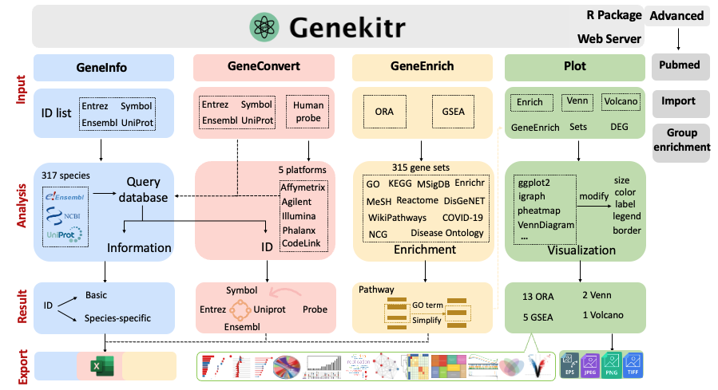

```{r initial, include=FALSE}
library(cowplot)
library(patchwork)

CRANpkg <- function (pkg) {
    cran <- "https://CRAN.R-project.org/package"
    fmt <- "[%s](%s=%s)"
    sprintf(fmt, pkg, cran, pkg)
}

Biocpkg <- function (pkg) {
    sprintf("[%s](http://bioconductor.org/packages/%s)", pkg, pkg)
}

Githubpkg <- function (user, pkg) {
    gh <- "https://github.com"
    fmt <- "[%s](%s/%s/%s)"
    sprintf(fmt, pkg, gh, user, pkg)
}

pkgVersion <- function(pkg, col="green") {
    ver <- packageVersion(pkg)
    uni <- paste0("")
    url <- paste0("https://github.com/GangLiLab/", pkg)
    
    res <- paste0("[", uni, "](", url, ")")
    return(res)
}

Entrez <- function(gene){
  sprintf("[%s](https://www.ncbi.nlm.nih.gov/gene/%s)", gene, gene)
}

Ensembl <- function(gene){
  sprintf("[%s](https://www.ensembl.org/id/%s)", gene, gene)
}

Uniprot <- function(pro){
  sprintf("[%s](https://www.uniprot.org/uniprot/%s)", pro, pro)
}

library(knitr)
opts_chunk$set(message=FALSE, warning=FALSE, eval=TRUE, 
    echo=TRUE, cache=TRUE, out.width="98%")
```


# 🧬 Welcome to genekitr! {-}

`r pkgVersion("genekitr")`
`r pkgVersion("geneset")`

This book is a practical tutorial on searching for gene information, converting gene, protein, and probe identifiers, performing gene enrichment analysis, and creating publication-ready plots.

If you are new to R, do not worry. This book provides plenty of example code to help you get started. After reading this book, you will be able to perform enrichment analyses and create informative plots using your own data.


```{r workflow, echo=FALSE}

```


## 🍱 Content {-}

+ Part 1 (Search Information) shows you how to search for gene metadata and PubMed articles.
+ Part 2 (ID Conversion) describes identifier conversion among gene symbols and aliases, NCBI Entrez Gene IDs, Ensembl IDs, UniProt IDs, and microarray probe IDs.
+ Part 3 (Enrichment Analysis) introduces gene sets and two widely used functional enrichment methods: over-representation analysis (ORA) and functional class scoring (FCS).
+ Part 4 (Plotting) includes 13 plots for ORA results, 5 plots for FCS-GSEA results, 2 Venn diagrams, and 1 volcano plot.

## 💝 Welcome to contribute {-}

The source code for this book is available at <https://github.com/GangLiLab/book_genekitr>.

If you have any ideas, suggestions, or questions, please feel free to [open an issue](https://github.com/GangLiLab/book_genekitr/issues/new).
